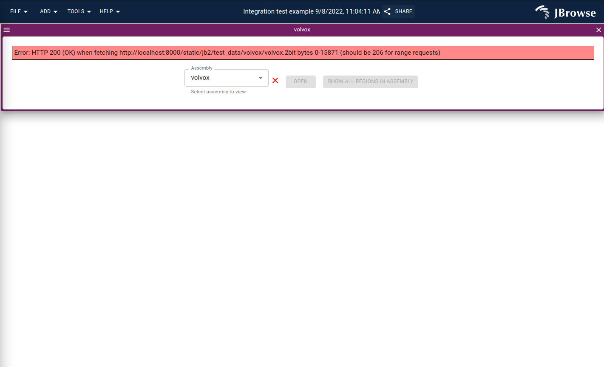

# django jbrowse 2 example (non-working at the moment)

The django web server does not respond to range requests for static files,
which jbrowse uses many of.

This example just updated the settings.py for static file support slightly, and
then I used `jbrowse create jb2` inside the static folder.

Then, I can visit
http://localhost:8000/static/jb2/index.html?config=test_data%2Fvolvox%2Fconfig.json
to try the jb2 demo data, but the lack of range request makes it give an error
on startup

There is also issue using files with .gz extension because it adds
Content-Encoding:gzip which produces visible error "TypeError: failed to fetch"
with inside the devtools, the error corresponds to
"(failed)net::ERR_CONTENT_DECODING_FAILED" in the network tab (the sign of
Chrome trying to unzip instead of the jbrowse code, and Chrome doesn't make
that error message available to the js code)

It is likely that instead of using django static file hosting, you should host
static files, especially jbrowse data files like fasta, tabix, bam, cram,
bigwig, etc on an external server like apache following advice like
https://docs.djangoproject.com/en/4.1/howto/static-files/deployment/#serving-static-files-in-production
